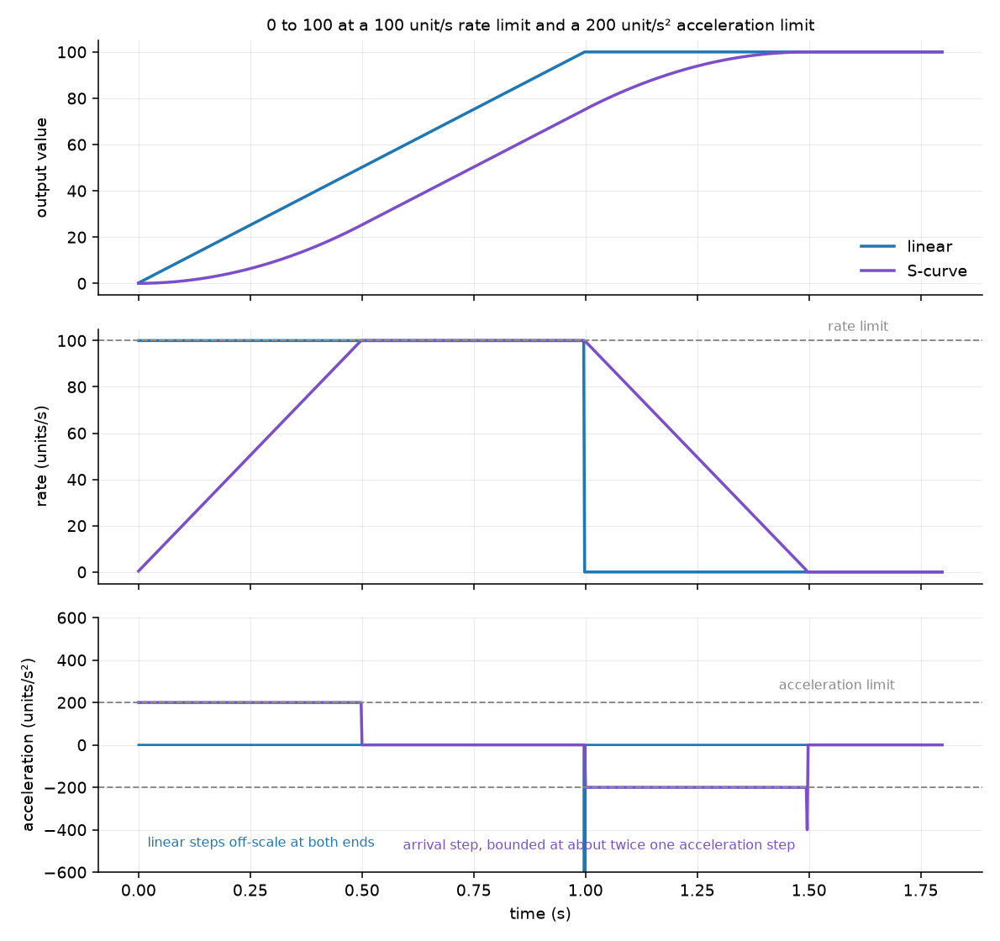
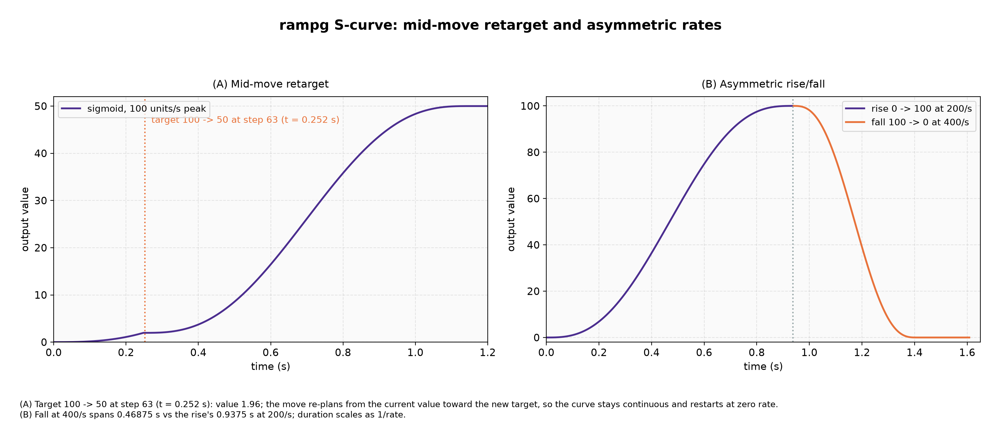

# S-curve ramp profile

The `rampg` library ships two ramp profiles. The default, `RAMPG_SHAPE_LINEAR`, moves at a constant rate from the current value to the target. The S-curve profile, `RAMPG_SHAPE_SCURVE`, bounds how fast the output rate itself may change, so the output eases in and out of a move instead of stepping in and out. This document explains the S-curve profile: what it buys you, how it is configured, how it is computed, and what the generated graphs show.

The rest of the public API (targets, limits, resets, `rampg_update`, and enable/disable) behaves the same in both profiles. See the README for the full API reference.

## Why an S-curve

A linear step has a hard change in rate at both ends. The rate jumps from zero to `rate` at the start of the move, and from `rate` back to zero at the end. For a physical actuator (a motor, a valve, a power supply) those two jumps are impulsive: they show up as a jerk that can excite mechanical resonance, spin up inductors, or trip a soft limit.

The S-curve removes those steps. The rate starts at zero, rises to the configured peak, holds there through the middle of the move, and falls back to zero. The output is still bounded by the configured rate, and now the *change* in that rate is bounded too, by the configured acceleration.

The cost is time. A move long enough to reach the configured rate takes `rate / accel` seconds longer than the equivalent linear move: the ramp spends half that time easing in and half easing out. That is a fixed overhead set by the two limits, not a multiple of the move length.

## Configuration

Two limits shape the move:

- `rampg_set_rate` (or `rampg_set_rates`) sets the **rate limit**, the greatest speed the output may travel at. It means the same thing in both profiles.
- `rampg_set_accel` sets the **acceleration limit**, the greatest amount the output rate may change per second. It applies only to the S-curve profile.

Both limits can be set per direction, with `rampg_set_rates` and `rampg_set_accels`. The pair for the direction of the move governs it throughout, including through a reversal, so the two legs never compromise each other.

```c
#include "rampg.h"

/* Ease a setpoint from 0 to 400 V, at most 50 V/s and at most 200 V/s^2. */
rampg_t vbus;
rampg_init(&vbus, 0.0f);
rampg_set_shape(&vbus, RAMPG_SHAPE_SCURVE);
rampg_set_rate(&vbus, 50.0f);
rampg_set_accel(&vbus, 200.0f);
rampg_set_limits(&vbus, 0.0f, 800.0f);
rampg_set_target(&vbus, 400.0f);

/* From the control loop, as usual. */
while (!rampg_at_target(&vbus)) {
    float v = rampg_update(&vbus, 0.001f);
    /* apply v */
}
```

### Asymmetric legs

A rise and a fall often have different jobs. A DC bus is eased up under control and tripped down on a fault; a drive is accelerated gently and stopped hard. Setting only the rates asymmetrically is not enough, because a single acceleration limit then has to serve both: pick one gentle enough for the rise and the trip takes seconds, pick one fast enough for the trip and the rise steps rather than eases.

Setting both per direction resolves it. For a 400 V bus at 50 V/s up and 2000 V/s down:

| Configuration | rise 0 to 400 | trip 400 to 0 |
| --- | --- | --- |
| symmetric `accel` 100 | 8.50 s | 4.00 s |
| symmetric `accel` 20000 | 8.00 s | 0.30 s |
| `accels(100, 40000)` | 8.50 s | 0.25 s |
| linear reference | 8.00 s | 0.20 s |

The first row cannot trip, the second cannot ease, and the third does both.

```c
rampg_set_rates(&vbus, 50.0f, 2000.0f);      /* 50 V/s up, 2 kV/s down    */
rampg_set_accels(&vbus, 100.0f, 40000.0f);   /* eased up, tripped hard    */
```

The defaults can also be set at compile time, before including `rampg.h`:

```c
#define RAMPG_DEFAULT_SHAPE RAMPG_SHAPE_SCURVE
#define RAMPG_DEFAULT_ACCEL 500.0f
#include "rampg.h"
```

`RAMPG_DEFAULT_ACCEL` sets both directions at initialisation.

### How long a move takes

Let `d` be the distance, `r` the rate limit and `a` the acceleration limit. If the move is long enough for the ramp to reach `r`, the rate profile is a trapezoid and the move takes

```
t = d / r + r / a
```

If it is not, the ramp reaches only `sqrt(a * d)` before it must start braking. The rate profile is then a triangle and the move takes

```
t = 2 * sqrt(d / a)
```

The changeover is at `d = r^2 / a`.

## How it is computed

The generator carries two pieces of state between updates: the output `value` and the output rate `vel`. There is no plan and no move clock. Each update does three things.

The rate limit and the acceleration limit are both chosen by the direction of the move, so `rate` and `accel` below mean the pair for that direction.

**1. Approach the cruise rate.** The rate moves toward the rate limit, in the direction of the target, by no more than one acceleration step:

```
want = copysign(rate_limit, target - value)
vel += clamp(want - vel, -accel * dt, +accel * dt)
```

**2. Stay inside the braking envelope.** The rate is then clamped to the greatest speed from which the ramp can still stop exactly on the target without ever exceeding the acceleration limit:

```
vel = clamp(vel, -vb, +vb)
```

**3. Advance the output.** `value += vel * dt`, snapping to the target if that step reaches or passes it.

### Deriving the braking envelope

The update applies the new rate to the value within the same tick. So if the ramp is travelling at `v` and decelerates at `a` from here on, the value advances by `v`, then `v - a*dt`, then `v - 2*a*dt`, and so on, down to zero. Over the `n = v / (a*dt)` steps that takes, the distance covered is

$$
d(v) = dt \sum_{k=0}^{n} (v - k\,a\,dt) = \frac{v^2}{2a} + \frac{v\,dt}{2}
$$

The envelope is the inverse: the greatest `v` whose stopping distance still fits in the distance remaining. Solving $v^2 + a\,dt\,v - 2ad = 0$ for the positive root, and rationalising it to avoid the cancellation the direct root suffers as `d` approaches zero, gives

$$
v_b(d) = \frac{-a\,dt + \sqrt{(a\,dt)^2 + 8ad}}{2} = \frac{4ad}{a\,dt + \sqrt{(a\,dt)^2 + 8ad}}
$$

The denominator of the rationalised form is at least `2 * a * dt`, so the expression is well defined for any `a > 0` and `dt > 0` and needs no special case at `d = 0`.

### Why the envelope is a clamp and not a target

It is tempting to make `v_b` the rate the ramp aims for, and let the acceleration limiter walk toward it. That formulation is unstable, and the instability is easy to miss because it only shows up at the end of a move.

Write the tracking error as `e = v - v_b`. Because `v_b` falls with the remaining distance, and the distance falls in proportion to the current speed, the error obeys

$$
\frac{de}{d\,\text{step}} \approx \frac{a\,dt\,e}{v_b}
$$

which grows without bound as `v_b` falls to zero. A limiter that is exactly critical cannot recover from any error, and float rounding alone is enough to introduce one. Measured over a randomised sweep, that lag left the ramp arriving at the target at up to 432 times one acceleration step instead of coming to rest on it.

Clamping instead of tracking removes the feedback entirely. The state is always on or inside the envelope, so there is no error to accumulate, and the envelope is only ever consulted to reduce the rate.

### Landing

A move ends in one of two ways. Normally the step reaches or passes the target and the ramp snaps to it, which is what makes `rampg_at_target` exact. Because the envelope has already brought the rate down, the rate at that last update is small: without a late retarget it is at most about twice one acceleration step.

The second case is a numerical one. `value` is a `float`, so once the step falls below the resolution of the accumulator the value stops changing however many updates pass. When that happens and the envelope is the constraint binding the rate, the rate can only fall further and the target can never be reached by accumulation, so the ramp lands on it. When some other limit is binding, the rate is still rising and will clear the resolution floor, so the ramp holds and carries on. Without that distinction a ramp either stalls just short of its target or, worse, jumps the whole remaining distance at the start of a move that begins from a large value.

### Guaranteed properties

For any `rate > 0`, `accel > 0` and `dt > 0`, and whatever the caller does to the target, rates, limits, or shape between updates:

- The output rate never exceeds the configured rate limit for its direction.
- The output rate changes by at most `accel * dt` per update. The bound is exact in real arithmetic; in `float` the envelope clamp can round slightly past it, measured at no more than 1.2 times `accel * dt` over a randomised sweep of twenty thousand moves. On the update that arrives at the target the rate falls to zero from at most about twice `accel * dt`.
- The output never overshoots the effective target, and never leaves the limits.
- The output rate is continuous across a target change, a rate change, an acceleration change, and a switch from the linear profile.
- The output arrives exactly on the effective target, so `rampg_at_target` becomes true.

There is one documented exception to the acceleration bound. If the target is moved to a point *inside* the current braking distance, no bounded deceleration can stop there. The generator prioritises not overshooting the target: it decelerates as hard as the envelope demands and stops on the target. If your application would rather overshoot and come back than exceed the acceleration limit, keep the target outside the braking distance `vel^2 / (2 * accel)`, which `rampg_get_rate` gives you everything to compute.

## Reading the rate and state

`rampg_get_rate` returns the signed output rate in units per second. Under the S-curve profile it is the rate the last `rampg_update` actually applied, so it is exact rather than inferred. It stays correct across a target, rate, limit, or shape change, because the rate is carried across the change rather than being recomputed, which makes it usable directly as a feedforward term.

`rampg_get_state` returns `RAMPG_STATE_DISABLED` whenever the ramp is disabled, and otherwise `RAMPG_STATE_MOVING` or `RAMPG_STATE_AT_TARGET` against the **effective target** (the stored target clamped to the active limits). `rampg_at_target` is purely positional and ignores the enabled flag, so use `rampg_get_state` when you need to tell a held ramp from a moving one. Because the state resolves against the clamped target, a target outside the limits is treated as reachable at the clamped value: the ramp moves there, then reports at-target with a zero rate. There is no separate "unreachable" state.

## Enabling and disabling

A ramp can be paused with `rampg_set_enabled` and resumed on demand. A disabled ramp holds its output: `rampg_update` returns the value unchanged and `rampg_get_rate` reads zero. Disabling also clears the stored rate, because a held output is genuinely at rest; re-enabling therefore eases away from rest rather than resuming at a rate the output no longer has. The target, rates, acceleration, limits, and shape are all preserved.

## Reading the graphs

The graphs below are generated by `docs/plot_scurve.py`, which compiles the library and drives it through `ctypes`, so they show the actual behaviour rather than a re-derivation of it. Regenerate them with `python docs/plot_scurve.py`.

### Value, rate and acceleration



A 0 to 100 move at a 100 unit/s rate limit and a 200 unit/s² acceleration limit, sampled at 2 ms.

- **Value** (top). The blue linear trace is a straight line reaching 100 at 1.0 s. The violet S-curve eases away from 0, runs straight through the middle, and eases into 100 at 1.5 s. The extra 0.5 s is `rate / accel`.
- **Rate** (middle). The linear trace is a rectangle: full rate immediately, zero immediately. The S-curve trace is a trapezoid that reaches the same 100 unit/s peak. Both are bounded by the same rate limit, which is the point of keeping that limit's meaning unchanged between profiles.
- **Acceleration** (bottom). The S-curve trace sits on ±200 while easing and at zero while cruising. The linear trace has no bound at all: its steps at both ends run off the scale. The small violet step at the end is the arrival, bounded at about twice one acceleration step.

### Retarget, reversal and asymmetric rates



- **(A) Retarget and reversal.** The move starts toward 100. At 0.5 s the target moves to 160, and at 1.2 s it moves to -40, behind the current value. The rate trace is continuous throughout: it holds at the rate limit through the retarget, then walks down through zero at the acceleration limit and back up to the limit in the opposite direction. Nothing restarts, and nothing steps.
- **(B) Asymmetric rise and fall.** A 0 to 200 move at 50 unit/s up and 150 unit/s down, with 100 unit/s² up and 600 unit/s² down. Each leg cruises at its own rate limit and eases at its own acceleration limit, so the down leg is both faster and sharper. The corners of the two rate traces have visibly different slopes, which is the acceleration limit for each direction.

## Notes and limitations

- Acceleration is bounded but piecewise constant, so it steps between zero and ±`accel` at the corners of the profile. The output is continuous in value and rate but not in acceleration, and jerk is therefore unbounded. Jerk limiting is deliberately out of scope: it would need a third limit, a larger state, and a much more involved solver, for a bounded improvement over a profile that already protects the actuator from the rate steps that matter.
- The S-curve path evaluates one square root per update. On a target without hardware support for it, that is the dominant cost of the call. The linear path is unaffected.
- The output is a `float`. LINEAR retains sub-resolution movement until it can emit the next representable output value without exceeding its cumulative movement budget. The budget is a `float` too, so a move keeps progressing only while the step stays above about `2^-47` of the value magnitude; far below that the output never moves at all. SCURVE uses the landing rule above when its braking envelope falls below output resolution. Prefer keeping the ratio of value magnitude to per-update step within about `1e6` when the output must change on every update.
